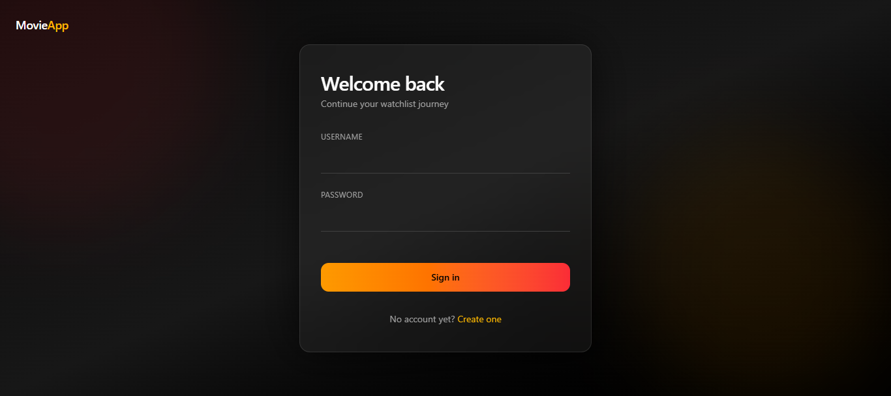
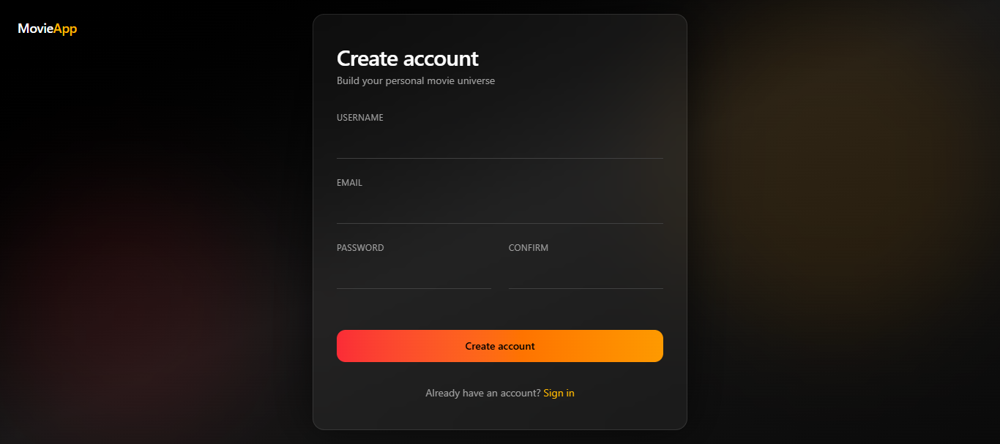
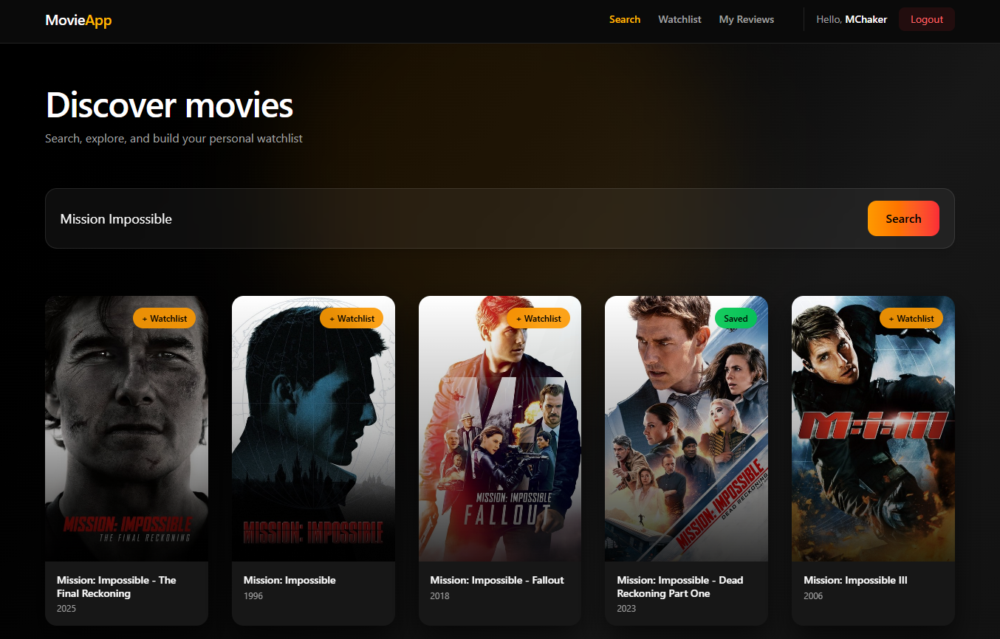
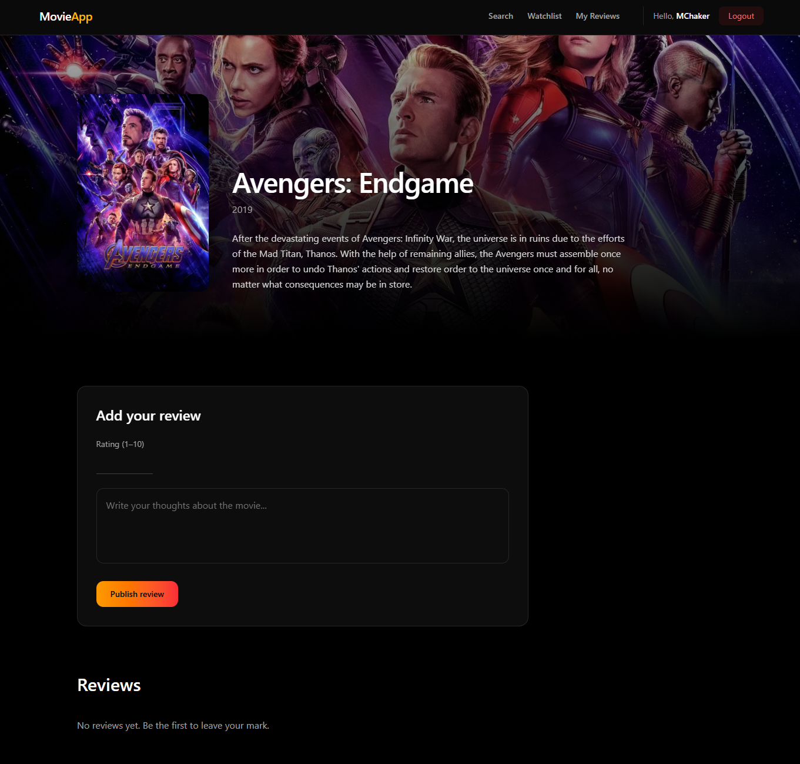
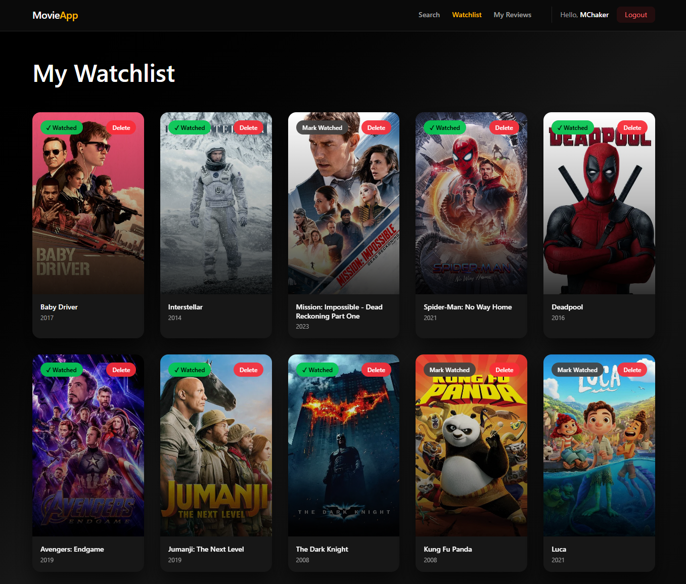
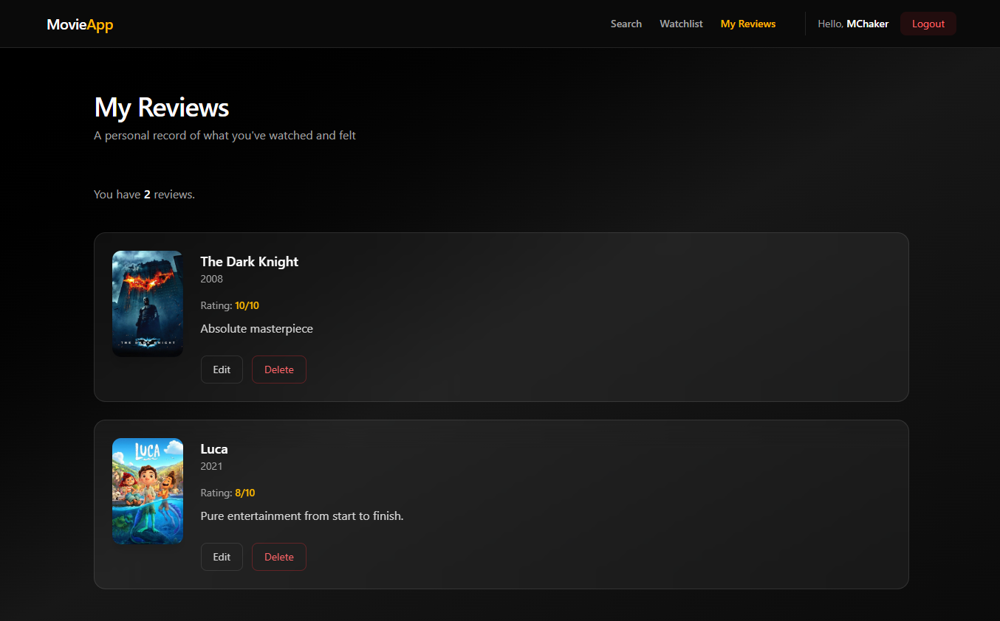

# MOVIE WATCHLIST & REVIEWS

## 📋 Overview
A full-stack movie management application where users can search for movies, manage their watchlist, and write reviews.

---

## 🎯 Features

### 1. Authentication System
- User registration and login
- JWT token-based authentication
- Protected routes for authenticated users
- Auto-logout on token expiration

**Screenshots:**




---

### 2. Movie Search (TMDB Integration)
- Search movies from The Movie Database (TMDB)
- Display movie posters, titles, and release years
- Click movie cards to view details
- Add movies to watchlist directly from search

**Screenshots:**



---

### 3. Movie Details Page
- View full movie information (poster, title, year, overview)
- See all reviews from all users
- Submit your own review (rating and/or comment)
- Reviews appear instantly after submission

**Screenshots:**



---

### 4. Watchlist Management
- View all movies in your personal watchlist
- Mark movies as watched/unwatched
- Delete movies from watchlist
- Click cards to view movie details

**Screenshots:**



---

### 5. My Reviews Page
- View all your personal reviews with movie posters
- Edit reviews (update rating or comment)
- Delete reviews with confirmation
- Movie details fetched automatically for each review

**Screenshots:**



---

### 6. Responsive Navigation
- Dynamic navbar based on authentication status
- Active page highlighting
- User greeting with username
- Logout functionality

---

## 🛠️ Tech Stack

### Backend
- **Node.js** - Runtime environment
- **Express** - Web framework
- **MongoDB + Mongoose** - Database
- **JWT** - Authentication
- **bcryptjs** - Password hashing
- **Axios** - HTTP client for TMDB API

### Frontend
- **React** - UI library
- **React Router** - Navigation
- **Context API** - State management
- **Axios** - API requests
- **Tailwind CSS** - Styling

---

## 📂 Project Structure
```
project-root/
├── backend/
│   ├── config/
│   │   └── db.js
│   ├── controllers/
│   │   ├── authController.js
│   │   ├── movieController.js
│   │   ├── reviewController.js
│   │   └── watchlistController.js
│   ├── middleware/
│   │   └── authMiddleware.js
│   ├── models/
│   │   ├── User.js
│   │   ├── Watchlist.js
│   │   └── Review.js
│   ├── routes/
│   │   ├── authRoutes.js
│   │   ├── movieRoutes.js
│   │   ├── reviewRoutes.js
│   │   └── watchlistRoutes.js
│   ├── services/
│   │   └── tmdbService.js
│   └── server.js
│
└── frontend/
    ├── src/
    │   ├── components/
    │   │   ├── MovieCard.jsx
    │   │   ├── Navbar.jsx
    │   │   ├── Spinner.jsx
    │   │   ├── ProtectedRoute.jsx
    │   │   └── GuestRoute.jsx
    │   ├── context/
    │   │   └── AuthContext.jsx
    │   ├── pages/
    │   │   ├── Login.jsx
    │   │   ├── Register.jsx
    │   │   ├── SearchMovies.jsx
    │   │   ├── MovieDetails.jsx
    │   │   ├── Watchlist.jsx
    │   │   └── MyReviews.jsx
    │   ├── services/
    │   │   └── api.js
    │   ├── main.jsx
    │   ├── index.css
    │   └── App.jsx
    └── package.json
```

---

## 🔑 Key Learning Outcomes

### Backend Concepts
1. RESTful API design
2. JWT authentication and authorization
3. MongoDB schema design and relationships
4. Middleware for route protection
5. External API integration (TMDB)
6. Error handling and validation

### Frontend Concepts
1. React Context API for global state
2. Protected routing patterns
3. Promise.all() for parallel requests
4. Object lookup patterns for performance
5. Modal UI patterns
6. Immutable state updates
7. Conditional rendering
8. Component reusability with props

---

## 🚀 Setup Instructions

### Prerequisites
- Node.js installed
- MongoDB running (local or Atlas)
- TMDB API key

### Backend Setup
```bash
cd backend
npm install
```

Create `.env` file:
```
PORT=3000
DB_URI=your_mongodb_connection_string
JWT_SECRET=your_secret_key
TMDB_API_KEY=your_tmdb_api_key
TMDB_BASE_URL=https://api.themoviedb.org/3
CLIENT_URL=http://localhost:5173
```

Start server:
```bash
npm run dev
```

### Frontend Setup
```bash
cd frontend
npm install
```

Create `.env` file:
```
VITE_API_URL=http://localhost:3000/api
```

Start development server:
```bash
npm run dev
```

---

## ✅ Project Checklist

- [x] User authentication (register, login, logout)
- [x] Movie search with TMDB API
- [x] Movie details page
- [x] Watchlist CRUD operations
- [x] Review CRUD operations
- [x] Responsive navbar
- [x] Protected routes
- [x] Error handling
- [x] Loading states
- [x] Professional UI/UX

---

## 🎓 Skills Demonstrated

**This project demonstrates proficiency in:**
- Full-stack JavaScript development
- RESTful API design and implementation
- Authentication and authorization
- Database modeling and relationships
- External API integration
- Modern React patterns (Hooks, Context)
- State management
- Responsive UI design
- Git version control

---

**⭐ If you found this project helpful, please consider giving it a star rating on GitHub!**
